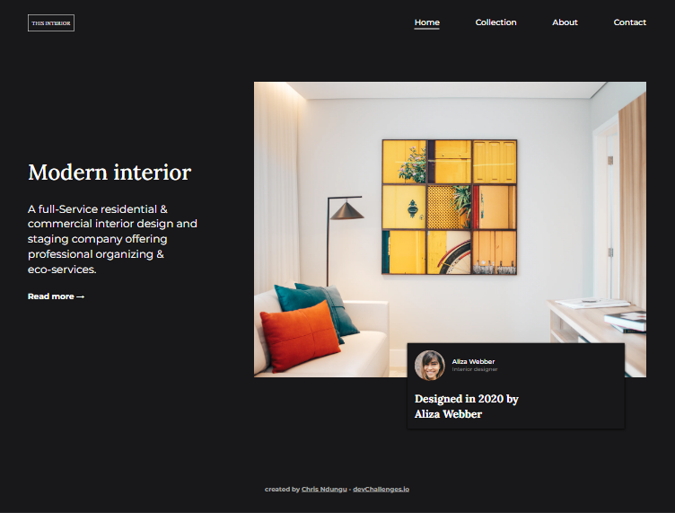
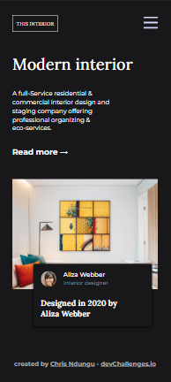
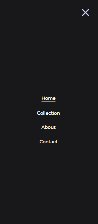

<!-- Please update value in the {}  -->

<h1 align="center">{Interior Consultant Landing Page}</h1>

   Solution for a challenge from  <a href="http://devchallenges.io" target="_blank">Devchallenges.io</a>.

  <h3>
    <a href="https://{your-demo-link.your-domain}">
      Demo
    </a>
     | 
    <a href="https://{your-url-to-the-solution}">
      Solution
    </a>
     | 
    <a href="https://devchallenges.io/challenges/Jymh2b2FyebRTUljkNcb">
      Challenge
    </a>
  </h3>

<!-- OVERVIEW -->

## Overview
Introduce your projects by taking a screenshot or a gif. 

- Where can I see your demo?
[demo]()

### Built With

<!-- This section should list any major frameworks that you built your project using. Here are a few examples.-->

- HTML
- CSS
- Javascript

## Contact

- GitHub [ChrisNdungu_dev](https://github.com/ChrisNdungu-dev)
- Twitter [Chris](https://twitter.com/Iam_ChrisN/)

